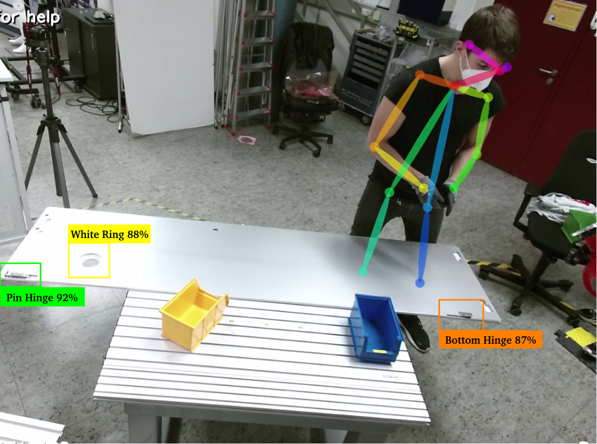

# Human Action Recognition Framework


This human action recognition (HAR) framework is an implementation for the purpose of classifying actions carried out by a human during industrial assembly tasks, in order to assist human-robot interactions.
To this purpose a dataset containing two assembly tasks, carried out by three different participants several times, were recorded, using a Kinect as RGB-D sensor. The RGB and depth information are used to determine the skeleton key points of human movement, as well as the component objects during each frame. For the keypoint detection [Openpose](https://github.com/CMU-Perceptual-Computing-Lab/openpose) is used and for the object detection [Darknet](https://github.com/pjreddie/darknet). The keypoints and objects of each frame are fed into four different types of Neural Networks and LSTMs, in order to dertermine the importance of each feature for the classification success on one hand end, as well as capability of predicting the correct action given an unseen video stream of one of the assembly tasks on the other.\
The HAR framework is divided into two major implementation parts:
* Recording and streaming of dataset, extraction of keypoints and objects (C++)
* Machine Learning architectures, data preprocessing, analaysis and evaluation of results (Python)
  
A full report of the HAR framework can be found here: [Human Action Reconition Framework](https://github.com/Kyrake/3D-Human-Pose-Estimation/blob/main/report/Human_Action_Recognition.pdf)


## Table of Contents

- [Introduction](#introduction)
- [Installation](#installation)
- [Usage](#usage)
- [Contributing](#contributing)
- [License](#license)

## Introdcution

<p align="center">

</p>

## Installation

The installation depends on wether the Kinect is used for recording or using realtime RGB-D streams or wether the framework operates solely on already recorded streams.
For the later case, you can skip the setup of the Kinect. 

### General Dependencies
* Python3
* tensorflow-gpu 1.13.0
* opencv3
* cuda 11.6

### Kinect Setup
For using the Ubuntu OS, install the Kinect driver [Freenect2](https://github.com/OpenKinect/libfreenect2)

### Key Point Detection Setup
First install [Openpose](https://github.com/CMU-Perceptual-Computing-Lab/openpose)

### Object Detection Setup 
First install [Darknet](https://github.com/pjreddie/darknet)

### Building 

### Running
Once you have compiled the application you can run the application from the `openpose/examples/tutorial_api_cpp` folder with\
`./../build/examples/tutorial_api_cpp/10_asynchronous_custom_input.bin --net_resolution "-1x128" --model_pose COCO`.
The configurations for using already recorded videos or using the kinect directly can be changed  by changing the comments in the respective lines in the following function:

```
    for(const string &text : list_test2){
            //playFreenect(net, alphabet, labels, classes, opWrapper);
            playVideo(net, alphabet, labels, classes, opWrapper, text);
        }
```


  
